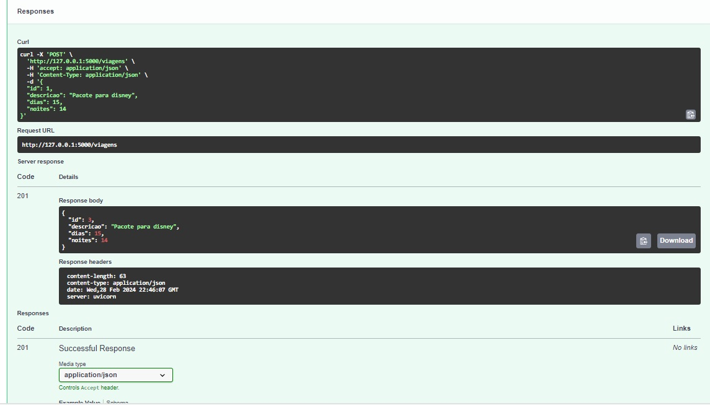
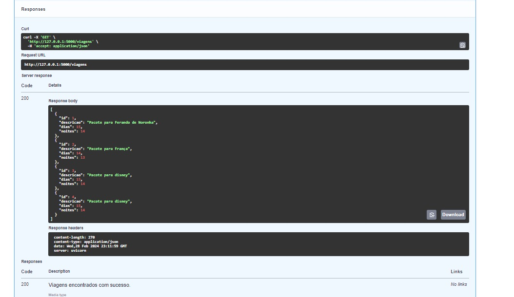
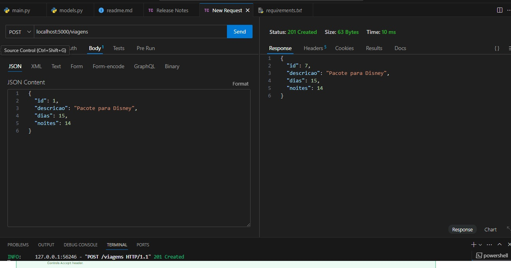
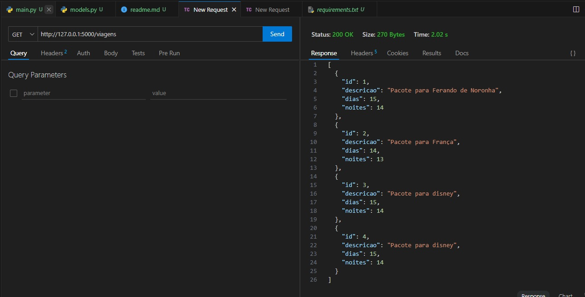

## API e Microserviços

Aula sobre swagger e thunder para visualizar e fazer requisições dos metodos utilizados na API.

### Swagger (FastApi)

*Metodo POST*

  
*Metodo GET*

  
### Thunder
Extensão utilizada no VS para realizar requisições
  
*Metodo POST*

  
*Metodo GET*

  
**INFOMAÇÕES**
 * instalar extensões:
    - thunderclient, swagger, python, material icons
 * Rodar no cmd
    - Criar um ambiente virtual : python -m venv env 
    - Entrar no ambiente: env\Scripts\activate
    - pip install fastapi uvicorn
    - pip freeze && pip freeze > requirements.txt \t
    - Roda a aplicação: uvicorn main:app --host 127.0.0.1 --port 5000

